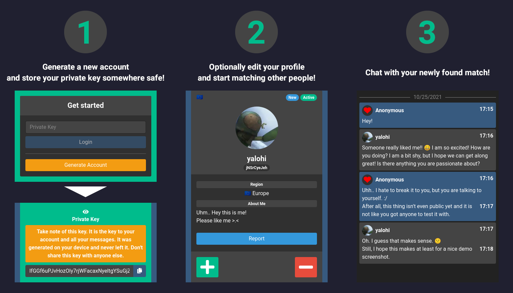

# SimplyMeet

[](https://matrix.to/#/#simplymeet:matrix.org)
[](https://discord.gg/bn5f6hryEG)


A community based, private and self hosted platform to meet people, make new friends or to find love. Simple to use, cross-platform, free and open source (**FOSS**), developed by the people, for the people. Start your own instance or join one of the officially listed on [**simplymeet.app**](https://simplymeet.app/).

## How it works


## Motivation
It can be very difficult to find another person to form a true, meaningful connection with. Most of the popular social media and community interaction platforms focus on massive exposure, sometimes completely public. While it can be great sharing your thoughts and feelings with a larger audience, it often boils down to a small subset of the group actively chatting, while the majority of paticipants end up only reading the conversations of others. For people with a quiet nature, being shy or suffering from social anxiety, taking part in already established groups can be overwhelming; making them feel unwelcome and like they don't belong.

Then there are dating apps. Centralized, controlled by large companies - trying to turn peoples loneliness and misery into cold, hard cash. Harvesting of user data, abusive paywalls, fake matches... All to make a profit and keep the poor souls on the platform for as long as they can.

I believe we can do better. We can develop, host and share our own platforms. SimplyMeet aims to solve the problems of big social media, offering you the possibility to create your own community space and meet people just like you.

## Dependencies
To build and run SimplyMeet you will need the following software installed:
* [**Git**](https://git-scm.com/) (Cloning + Scripts)
* [**Rsync**](https://rsync.samba.org/) (Scripts)
* [**.NET 5.0 SDK**](https://dotnet.microsoft.com/download/dotnet/5.0) (Building)
* [**Docker + Docker-Compose**](https://www.docker.com/) (Building + Running) [Optional]

## Clone the project
```
git clone https://github.com/yalohi/SimplyMeet
cd SimplyMeet
```

## Configuration
### Client (WASM)
* **`SimplyMeetShared/Constants/ApiRequestConstants.cs`**
  * Set **`BASE_ADDRESS`** to the location of your WebApi Backend on your domain.

### Server (WebApi)
* **`SimplyMeetApi/appsettings.Production.json`**
  * Make sure to set a strong **`SecretKey`** in the **`TokenConfiguration`** section.
  * Use the **`MainAdminPublicId`** field in the **`AdminConfiguration`** section to give yourself administrative privileges after creating your first account.

### Docker
* Add your own certificates to **`Docker/reverse-proxy/`**

## Get started (Linux Server + Docker) [Recommended]

Run the scripts with **`sudo`** if your user isn't part of the docker group!

```
cd Scripts
./build.sh
./run.sh
```

**Done.** This will launch 3 Docker containers.
* **`simplymeet-reverse-proxy`**
* **`simplymeet-wasm`**
* **`simplymeet-webapi`**

And 3 Docker volumes.
* **`simplymeet-wasm-app`**
* **`simplymeet-webapi-app`**
* **`simplymeet-webapi-data`**

Some utility scripts you can use include:

```
./backup-create.sh
```

Creates a new backup of the **`simplymeet-webapi-data`** volume and deletes backups older than 7 days.

```
./backup-restore.sh [N]
```

Restores the **`N`**'th available backup. A higher number means an older backup. When omitted **`N`**=1 by default for the latest backup.

```
./update.sh
```

Creates a data backup, pulls the latest changes and rebuilds the project.

## Get Started (Linux Server) [DIY Method]
```
cd Scripts
./build-no-docker.sh
```

In the newly created Build folder you will find:
* The Blazor WASM client, which you can serve as a static webpage using a web server such as [**nginx**](https://nginx.com/)
* The WebApi Backend, which runs its own web server (Kestrel) on a port configured in the appsettings file and can be served directly or behind a reverse proxy.

## License
SimplyMeet is licensed under the [**AGPLv3**](LICENSE) free software license.

## Joining our list of communities
If you want your own community listed on [**simplymeet.app**](https://simplymeet.app/) hop onto our Matrix or Discord server and send me a message with a link to your project, a short description and proof of ownership.

## Donate
If you want to support the development of this project, consider sending a small donation via one of the following ways. All your support is greatly appreciated. Thank you!

*  Monero (XMR)
* 84hvN7KcxxxCXpA8uNLvX3itFYZ2p6TNyDckP23E77FNMLSHcAa4cRH2K1YXnhNi9cc3XBB34nVHVZUVpM9Buu3oRz5A2LE

<p align="center">
	
</p>

*  Bitcoin (BTC)
* 1Euw6wkvJVRaV44DWwCWvR61Rnwe3gQ26D

<p align="center">
	
</p>
