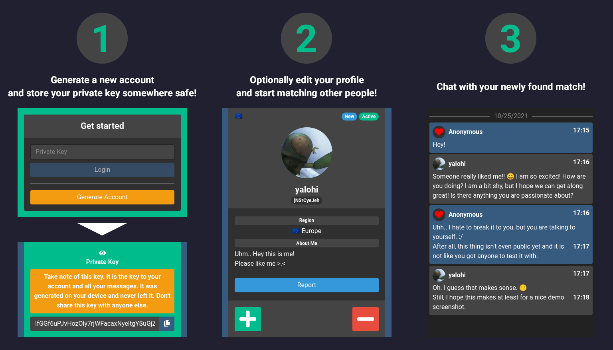

# SimplyMeet

[](https://matrix.to/#/#simplymeet:matrix.org)


A community based, private and self hosted platform to meet people, make new friends or to find love. Simple to use, cross-platform, free and open source (**FOSS**), developed by the people, for the people. Start your own instance or join one of the officially listed on [**simplymeet.app**](https://simplymeet.app/).

## How it works


## Motivation
It can be difficult to find true, meaningful connections to others. Most software that focuses on bringing communities together utilizes open and public spaces. While it can be great sharing your thoughts and feelings with a larger audience, it often boils down to a very small subset of the group being active with the majority of people only reading and lurking. For people that have a more quiet nature, being shy or suffering from social anxiety, participating in already established groups can be overwhelming making them feel unneeded and like they don't belong.

Then there are dating apps. Centralized and controlled by large companies, trying to make a profit out of peoples loneliness and misery, harvesting your data, including feature paywalls, with the objective to keep you on their platform for as long as they can.

I believe we can do better. We can develop, host and share our own platforms. SimplyMeet aims to solve these problems, offering you the possibility to create your own community spaces and meet like-minded people.

## Projects

* **SimplyMeetWasm**: The web client frontend, which can connect to any SimplyMeetApi server publicly available.

* **SimplyMeetApi**: The api server backend, which let's you host your own community instance.

**NOTE:** If you only want to host your own community, you'll only need the **SimplyMeetApi** project.

## Get started (Linux Server + Docker) [Recommended]

### Dependencies
* [**Docker + Docker-Compose**](https://www.docker.com/) (Building + Running)

### Run from pre-built Docker images
This method will download a pre-built version from the GitHub container registry.

* Download the [**docker-compose.yml**](Docker/docker-compose.yml) file.
* In your **docker-compose.yml** make sure to set a strong **`JWT_SECRET`** that is at least **32** characters long.
* [Configure](#configuration) the services.

```
docker compose up -d
```

### Build and run from source (github)
This method will clone the remote repository from GitHub and then build from that.

* Download the [**docker-compose.yml**](Docker/docker-compose.yml) file.
* Download the [**dockerfile-api-github**](Docker/dockerfile-api-github) file.
* Download the [**dockerfile-wasm-github**](Docker/dockerfile-wasm-github) file.
* In your **docker-compose.yml** comment out all services except **api-source-github** and **wasm-source-github**
* In your **docker-compose.yml** make sure to set a strong **`JWT_SECRET`** that is at least **32** characters long.
* [Configure](#configuration) the services.

```
docker compose up -d
```

### Build and run from source (local)
This method will build from source files already present on your machine. It will not download them from a remote server.

* Download the [**docker-compose.yml**](Docker/docker-compose.yml) file.
* Download the [**dockerfile-api-github**](Docker/dockerfile-api-github) file.
* Download the [**dockerfile-wasm-github**](Docker/dockerfile-wasm-github) file.
* In your **docker-compose.yml** comment out all services except **api-source-local** and **wasm-source-local**
* In your **docker-compose.yml** make sure to set a strong **`JWT_SECRET`** that is at least **32** characters long.
* [Configure](#configuration) the services.

```
docker compose up -d
```

### Configuration
* Create the following folder structures where the docker-compose.yml file resides. They will serve as Docker volumes:
  * `wasm/config/appsettings.Production.json` (WASM Configuration) [Default: [**appsettings.Production.json**](SimplyMeetWasm/wwwroot/appsettings.Production.json)]
  * `api/config/appsettings.Production.json` (API Configuration) [Default: [**appsettings.Production.json**](SimplyMeetApi/appsettings.Production.json)]
  * `api/data` (API Data Storage)

* Create a default Avatar for new users
  * `api/data/Avatars/Default.webp` [Default: [**Default.webp**](SimplyMeetApi/App_Data/Avatars/Default.webp)]

## Get Started (Linux Server) [DIY Method]

### Dependencies
To build and run SimplyMeet you will need the following software installed:
* [**Git**](https://git-scm.com/) (Cloning)
* [**.NET 10.0 SDK**](https://dotnet.microsoft.com/download/dotnet/10.0) (Building)

### Clone the project
```
git clone https://github.com/yalohi/SimplyMeet
cd SimplyMeet
```

### Build the project
```
Scripts/build-no-docker.sh
```

In the newly created Build folder you will find:
* The Blazor WASM client, which you can serve as a static webpage using a web server such as [**nginx**](https://nginx.com/)
* The WebApi Backend, which runs its own web server (Kestrel) on a port configured in the appsettings file and can be served directly or behind a reverse proxy.

### Configuration
* Environment Variables
  * Make sure to set a strong **`JWT_SECRET`** that is at least **32** characters long.

## Administration
* [**appsettings.Production.json**](SimplyMeetApi/appsettings.Production.json)
  * Use the **`MainAdminPublicId`** field in the **`AdminConfiguration`** section to give yourself administrative privileges after creating your first account.

## License
SimplyMeet is licensed under the [**AGPLv3**](LICENSE) free software license.

## Joining our list of communities
If you want your own community listed on [**simplymeet.app**](https://simplymeet.app/) hop onto our Matrix server and send me a message with a link to your project, a short description and proof of ownership.

## Donate
If you want to support the development of this project, consider sending a small donation via one of the following ways. All your support is greatly appreciated. Thank you!

*  Monero (XMR)
* 84hvN7KcxxxCXpA8uNLvX3itFYZ2p6TNyDckP23E77FNMLSHcAa4cRH2K1YXnhNi9cc3XBB34nVHVZUVpM9Buu3oRz5A2LE

<p align="center">
	
</p>

*  Bitcoin (BTC)
* 1Euw6wkvJVRaV44DWwCWvR61Rnwe3gQ26D

<p align="center">
	
</p>
